# Enterprise Kubernetes Architecture Portfolio

This repository is an end-to-end Kubernetes platform portfolio built on a local multi-node `kind` cluster. It demonstrates cluster bootstrap, resource governance, workload deployment, service networking, security controls, operational runbooks, and Kubernetes-native machine learning operations (MLOps).

The project is designed to show applied Kubernetes capability through working infrastructure, deployable application code, annotated manifests, and repeatable Bash automation.

## Project Areas

| Area | Folder | What it demonstrates |
|---|---|---|
| Kubernetes Platform Foundation | [setup/](setup/) | Local cluster creation, namespaces, pods, Deployments, Services, ConfigMaps, Secrets, Role-Based Access Control (RBAC), resource governance, health checks, and enterprise workload patterns. |
| Enterprise Three-Tier Application Platform | [app_k8_deployment/](app_k8_deployment/) | Browser user interface (UI), FastAPI backend, MariaDB database, Services, Ingress, PersistentVolumeClaim (PVC) storage, NetworkPolicy, HorizontalPodAutoscaler (HPA), PodDisruptionBudget (PDB), backup CronJob, rollout, rollback, and verification scripts. |
| Kubernetes-Native MLOps Serving Platform | [ml-serving/](ml-serving/) | KServe standard-mode serving, local model artifact storage, InferenceService deployment, Open Inference Protocol testing, model operations, and a custom FastAPI serving comparison. |

## Architecture

```mermaid
flowchart TB
    developer["Developer workstation<br/>Windows 11 + WSL2 Ubuntu + Docker Desktop"]
    kind["Local multi-node kind cluster<br/>1 control plane + 2 worker nodes"]

    developer --> kind

    subgraph setup["Kubernetes Platform Foundation"]
        cluster["Cluster bootstrap"]
        governance["Namespace, quota, limits, RBAC"]
        primitives["Pods, Deployments, Services, probes"]
        patterns["NetworkPolicy, HPA, PDB, affinity"]
        cluster --> governance --> primitives --> patterns
    end

    subgraph app["Enterprise Three-Tier Application Platform"]
        browser["Browser<br/>http://localhost:30001"]
        uiSvc["patient-intake-ui-service<br/>NodePort entry point"]
        uiPods["nginx UI pods<br/>static frontend + backend proxy"]
        apiSvc["patient-record-api-service<br/>private ClusterIP Service"]
        apiPods["FastAPI backend pods<br/>readiness checks database and schema"]
        dbSvc["patient-record-database-service<br/>private database Service"]
        db["MariaDB StatefulSet<br/>PersistentVolumeClaim storage"]
        backup["Backup CronJob<br/>scheduled SQL dump"]

        browser --> uiSvc --> uiPods --> apiSvc --> apiPods --> dbSvc --> db
        backup --> db
    end

    subgraph mlops["Kubernetes-Native MLOps Serving Platform"]
        kserve["KServe control plane"]
        modelStore["Local model artifact store<br/>PVC-backed stand-in for cloud object storage"]
        isvc["InferenceService<br/>model serving API contract"]
        runtime["sklearn runtime pod<br/>Open Inference Protocol endpoint"]

        kserve --> isvc --> runtime
        modelStore --> runtime
    end

    kind --> setup
    kind --> app
    kind --> mlops
```



## Capability Snapshot

- Local Kubernetes platform on `kind`, using Docker Desktop with WSL2 integration.
- Bash-first operational workflows suitable for Linux-based platform engineering.
- Kubernetes fundamentals: pods, Deployments, Services, namespaces, ConfigMaps, Secrets, probes, and rollout behavior.
- Security and governance: ServiceAccounts, Role-Based Access Control (RBAC), NetworkPolicy, ResourceQuota, LimitRange, and non-root container practices.
- Application platform operations: rolling update, rollback, smoke verification, observability commands, database backup, restore, and password rotation.
- Stateful workload handling with MariaDB, StatefulSet, PersistentVolumeClaim (PVC), schema initialization Job, and backup CronJob.
- Traffic design with NodePort for local access, ClusterIP Services for private in-cluster communication, and Ingress manifests for production-style HTTP entry.
- MLOps serving with KServe, InferenceService, local model artifact storage, Open Inference Protocol requests, and a custom FastAPI inference-server comparison.

## Local Environment

| Component | Target setup |
|---|---|
| Operating system | Windows 11 |
| Linux shell | Windows Subsystem for Linux 2 (WSL2) Ubuntu 22.04 |
| Container engine | Docker Desktop with WSL2 backend integration |
| Kubernetes cluster | `kind` local multi-node cluster |
| Memory profile | 16 GB machine, with Docker Desktop sized for local Kubernetes workloads |
| GPU context | NVIDIA RTX 2060, 6 GB VRAM, relevant for later machine learning serving work |

## Quick Start

Run commands from WSL2 Ubuntu, not PowerShell.

### 1. Prepare the workstation

```bash
cd "/mnt/d/Generative AI Portfolio Projects/kubernetes_architure"
bash setup/00-prerequisites/platform-guides/windows-wsl2/step-by-step-install.sh
```

This installs and verifies the local command-line tools used by the repository, including `kubectl`, `kind`, and Helm.

### 2. Create and verify the Kubernetes cluster

```bash
bash setup/01-cluster-setup/create-cluster.sh
bash setup/01-cluster-setup/verify-cluster.sh
```

Expected result: a local `kind` cluster with one control-plane node and two worker nodes.

### 3. Deploy the three-tier application platform

```bash
bash app_k8_deployment/deployment-lifecycle/build-application-images.sh
bash app_k8_deployment/deployment-lifecycle/load-images-into-kind.sh
bash app_k8_deployment/deployment-lifecycle/deploy-patient-record-system.sh
bash app_k8_deployment/deployment-lifecycle/verify-patient-record-system.sh
```

Expected result: the UI, FastAPI backend, and MariaDB database are running in the `patient-record-system` namespace.

Open the application:

```text
http://localhost:30001
```

### 4. Run the KServe model-serving path

```bash
bash ml-serving/01-kserve-standard-mode/install-kserve-standard-mode.sh
bash ml-serving/01-kserve-standard-mode/verify-kserve.sh

kubectl apply -f ml-serving/02-local-model-registry/01-namespace.yaml
kubectl apply -f ml-serving/02-local-model-registry/02-model-store-pvc.yaml
kubectl apply -f ml-serving/02-local-model-registry/03-model-store-loader-pod.yaml
bash ml-serving/02-local-model-registry/load-model-into-pvc.sh

kubectl apply -f ml-serving/03-wine-quality-inferenceservice/01-wine-quality-sklearn-isvc.yaml
bash ml-serving/03-wine-quality-inferenceservice/02-inspect-generated-k8s-objects.sh
bash ml-serving/03-wine-quality-inferenceservice/03-test-open-inference-v2.sh
```

Expected result: KServe creates the serving resources for the wine-quality model, and the test script sends an inference request using the Open Inference Protocol.

## Repository Map

```text
kubernetes_architure/
|-- setup/                  Kubernetes Platform Foundation
|-- app_k8_deployment/      Enterprise Three-Tier Application Platform
|-- ml-serving/             Kubernetes-Native MLOps Serving Platform
`-- documentation/          Reference material and deeper notes
```

## Operational Entry Points

| Task | Command |
|---|---|
| Create local cluster | `bash setup/01-cluster-setup/create-cluster.sh` |
| Verify local cluster | `bash setup/01-cluster-setup/verify-cluster.sh` |
| Build app images | `bash app_k8_deployment/deployment-lifecycle/build-application-images.sh` |
| Load app images into kind | `bash app_k8_deployment/deployment-lifecycle/load-images-into-kind.sh` |
| Deploy application platform | `bash app_k8_deployment/deployment-lifecycle/deploy-patient-record-system.sh` |
| Verify application platform | `bash app_k8_deployment/deployment-lifecycle/verify-patient-record-system.sh` |
| Observe application state | `bash app_k8_deployment/deployment-lifecycle/observe-patient-record-system.sh` |
| Simulate backend rolling update | `bash app_k8_deployment/deployment-lifecycle/simulate-rolling-update.sh 1.0.1` |
| Roll back backend | `bash app_k8_deployment/deployment-lifecycle/rollback-patient-record-api.sh` |
| Clean up application namespace | `bash app_k8_deployment/deployment-lifecycle/cleanup-patient-record-system.sh` |

## What This Shows

This project is a practical Kubernetes architecture snapshot covering platform setup, application deployment, runtime configuration, service discovery, private backend routing, persistent database storage, operational recovery, autoscaling policy, availability controls, and model serving on Kubernetes.

The implementation intentionally uses local infrastructure where appropriate, but the patterns map to managed enterprise environments such as Amazon Elastic Kubernetes Service (EKS), Google Kubernetes Engine (GKE), Azure Kubernetes Service (AKS), OpenShift, cloud load balancers, managed registries, secret managers, and GitOps deployment systems.
